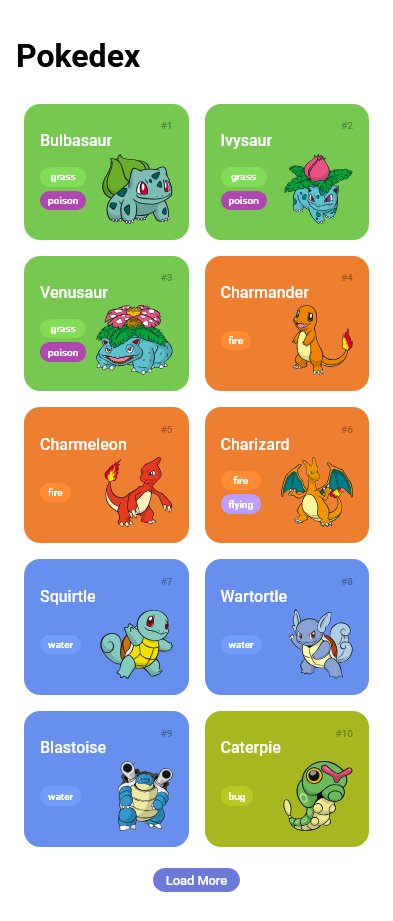
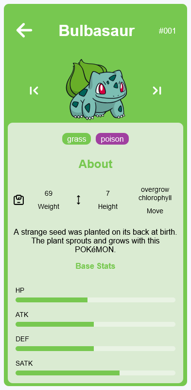

# Trilha JS Developer - Pokédex 🧑‍💻🐾

## Sobre o Projeto 💡

Este projeto foi desenvolvido como parte do Bootcamp **Rihappy** na **DIO (Digital Innovation One)**. O objetivo principal foi criar uma Pokédex interativa, consumindo dados da [PokéAPI](https://pokeapi.co/), para explorar e exibir informações sobre diferentes Pokémon. 🐉🦖

Este projeto foi elaborado com foco em praticar habilidades de desenvolvimento web, incluindo consumo de APIs, manipulação de DOM, e estilização dinâmica. Além disso, o projeto será continuamente atualizado e melhorado com novas funcionalidades e refinamentos. ⚙️🚀

---

## **Clique aqui para testar o Pokédex!** 🎮

[**Acessar a Pokédex**](#)

---

## Funcionalidades Implementadas 🌟

- **Consumo da PokéAPI:** A Pokédex consome dados diretamente da API para exibir detalhes atualizados sobre cada Pokémon. 🔍
- **Navegação entre Pokémon:** Botões para navegar entre os Pokémon usando seus IDs. ⬅️➡️
- **Estilização Dinâmica:** Alteração automática de cores e estilos baseada no tipo do Pokémon. 🎨
- **Informações Detalhadas:** Exibição de peso, altura, habilidades e estatísticas base de cada Pokémon. 📊📏
- **Progress Bars Dinâmicas:** Barras de progresso que mudam de cor conforme o tipo do Pokémon. 📈

---

## Imagens do Projeto 📸

1. **Visualização Inicial da Pokédex**  
2. **Detalhes de um Pokémon**  

    
    

---

## Tecnologias Utilizadas 🛠️

- **HTML5** para a estrutura da aplicação. 📝
- **CSS3** para a estilização responsiva e dinâmica. 🎨
- **JavaScript ES6+** para manipulação de DOM e lógica da aplicação. ⚡
- **PokéAPI** para fornecimento dos dados dos Pokémon. 🖥️

---

## Futuras Melhorias 🚧

- Adicionar suporte para mais de 151 Pokémon. ⚡
- Implementar busca por nome ou número do Pokémon. 🔍
- Melhorar a responsividade para dispositivos móveis. 📱
- Adicionar animações para transições suaves entre telas. 🎞️
- Incluir mais informações e interações, como habilidades detalhadas e evoluções. 🌱

---

## Conecte-se comigo no LinkedIn! 🌐  

[**Meu LinkedIn**](https://www.linkedin.com/in/marlon-alvss/)

---

### Créditos 🙏

Este projeto foi desenvolvido com o apoio do bootcamp da **DIO** em parceria com a **Rihappy**. Agradecimentos especiais aos instrutores e à comunidade pelo suporte contínuo! 🌟
